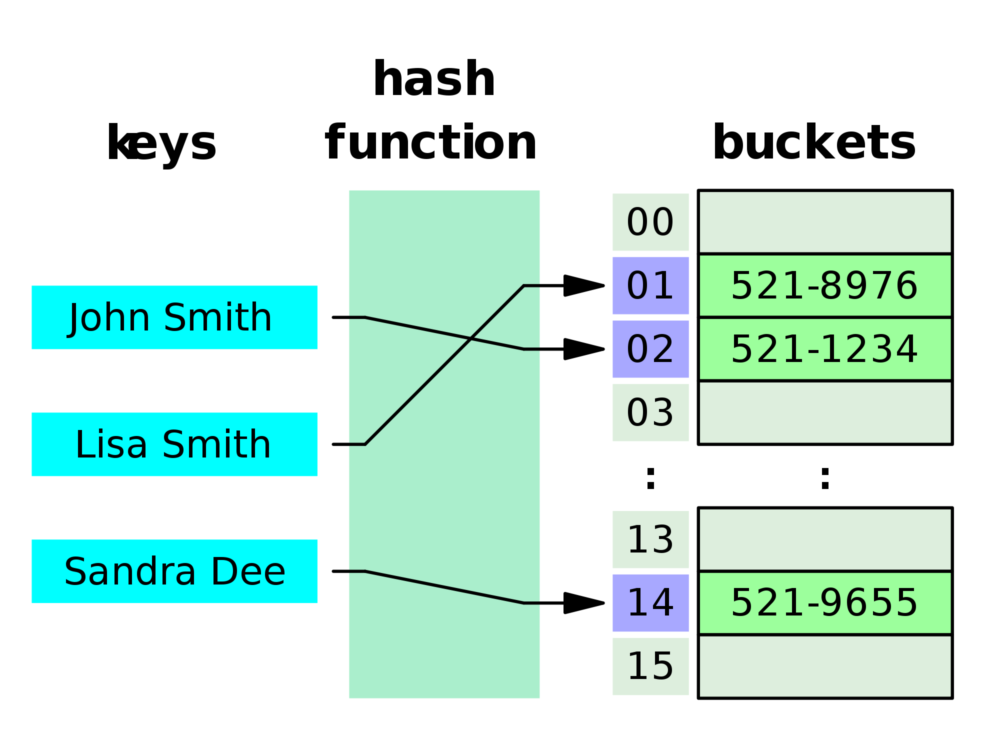
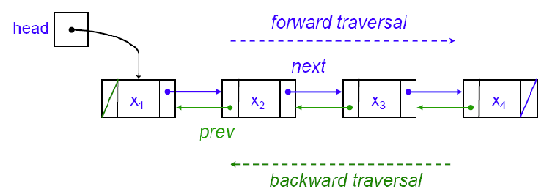

#Data Structures

##Introduction

In this challenge, you will be creating data structures that are commonly use in software engineering. Understanding data structures allows engineers to store their data in optimal formats. A description of each data structure is provided in the [Summary](#summary). Feel free to look online for additional information about each structure. NOTE: This challenge intentionally avoids using ES6 classes in order to develop a deeper understanding of the prototype chain.

Learning goals

- Understand [pseudoclassical inheritance pattern](http://davidshariff.com/blog/javascript-inheritance-patterns/)
- Understand the use case of data structures provided in challenges
- Be able to reimplement data structures provided in challenges

##Summary

###[Stack](https://en.wikipedia.org/wiki/Stack_(abstract_data_type))
<br>
A data structure that serves as a collection of elements, with two principle operations: push and pop. Push adds an element to the collection. Pop removes the last element that was added. This data structure follows the "Last In, First Out" principle (LIFO), where the elements that were most recently pushed (added) to the stack, are popped off (removed) first.

Think of a stack of pancakes - you add pancakes to the top of the stack and eat them from top to bottom.

###[Queue](https://en.wikipedia.org/wiki/Queue_(abstract_data_type))
<br>
A data strucure that serves as a collection of elements that preserves the order at which the elements are inserted. The principle operations are enqueue, which adds an element to the collection, and dequeue, which removes the element that was added the earliest. This data structure follows the "First In, First Out" principle (FIFO), where elements that are enqueued (added) into the queue first, are dequeue (removed) first.

Think of a line for a roller coaster - the people that enter the line first, are the ones that get on the ride first.

###[LinkedList](https://en.wikipedia.org/wiki/Linked_list)
<br>
A data structure that serves as a collection of elements. Data is stored in nodes, and each node has a reference to the next node. In order to access elements from a linked list, the first node (or head) is checked. If the element is not present in the first node, then the node that is referenced by the head (the second node) is checked. This action is repeated until the entire list is inspected. The two principle operations are push (or add) and contains. Push creates a new node and adds
it to the end of the list. Contains checks the entire list and determines if the element is present in any of the nodes.

###[Hash Table](https://en.wikipedia.org/wiki/Hash_table)
<br>
A data structure that stores key-value pairs (similar to the way an object works in javascript). The location in memory where the element is stored is determined by running the key through a hash function. The hash function accepts a key and returns an address where the element should be inserted/retrieved.

A common problem occurs when two distinct keys are converted to the same address - an occurrence called a collision. Collisions need to be handled in a way that ensures no data is overwritten and all data can still be efficiently retrieved.

###[Binary Search Tree](https://en.wikipedia.org/wiki/Binary_search_tree)
<br>
Similar to a tree, except with a few constraints:

* each node can only have up to 2 children

* the left child must have a smaller value than its parent

* the right child must have a greater value than its parent

###[Set](https://en.wikipedia.org/wiki/Set_(abstract_data_type))
<br>
A data structure that specializes in determining if an object is present in a collection or not. The two principle operations are add, which adds an element to the set, and contains, which determines if an element is present in the set. Elements present in the set are distinct, and adding duplicate elements does not increase the size of the set.

###[Tree](https://en.wikipedia.org/wiki/Tree_(data_structure))
<br>
A data structure that stores elements in a hierarchical manner (an example would be if you were storing a family tree). Each element is stored in a node, and each node has a references to its children (the nodes below that node). Each node can only have one parent.

###[Graph](https://en.wikipedia.org/wiki/Graph_(abstract_data_type))
<br>
A collection of nodes that have references to other nodes.

A good use case of a graph would be to store data of people in a social network. Each node not only contains data about an person, but also a reference to another person. Retrieving a person's friends would only involve looking at one node's references to other nodes.

###[Doubly LinkedList](https://en.wikipedia.org/wiki/Doubly_linked_list)
<br>
Similar to a linked list with the addition that each node also has reference to the previous node.

##How do I get started?
1. Have BOTH partners fork this repo
  - click on the **Fork** button on the top right of the page
<br></img>  
  - click on your handle to fork to your repo

2. Choose one partner's GitHub repo to work from, and clone it to your shared machine
  - first, make sure you're on your new forked repo on GitHub
  - copy and paste github url from the right side of the page
<br></img>
  - enter the following line into your command line and insert your copied url instead of the quoted text:
  ```
  git clone 'copied url'
  ```
3. Add two remote links to the cloned repo on your shared workstation: one to CodesmithLLC's repo, and one to the partners repo that was not cloned:
  ```
  git remote add upstream https://github.com/CodesmithLLC/unit-2-data-structure.git
  ```
  ```
  git remote add partner https://github.com/PARTNERS_GITHUB_HANDLE/unit-2-data-structure.git
  ```
3. Each partner clone their own repo to their own laptop, following the clone instructions in step 2
4. Each partner add two remote links to their clone on their own laptop, one to CodesmithLLC's repo, and one to their partner's repo, following the instructions in step 3
5. As you work on the shared workstation, periodically push your changes to your repo with `git push origin master`. Your partner can then use `git pull partner master` to get the changes onto their machine, followed by `git push origin master` to push those changes to their own GitHub repo!

Check out the [GitHub Documentation](https://help.github.com/articles/fork-a-repo/) for a more in-depth explanation of forking and cloning.

##Challenges

Complete the challenge in located in ```src/ directory```. We recommend completing the data structure in the following order (the order they appear in the tests):

- Stack
  - [ ] Implement the ```.push``` method, which adds an element to the top of the stack
  - [ ] Implement the ```.pop``` method, which removes and returns an element from the top of the stack

- Queue
  - [ ] Implement the ```.enqueue``` method, which adds an element to the front of the queue
  - [ ] Implement the ```.dequeue``` method, which removes and returns an element at the end of the queue

- Set
  - [ ] Implement the ```.add``` method, which adds an element to the set (does not add an object if the object is already present in set)
  - [ ] Implement the ```.contains``` method, which determines if an element in present in a set
  - [ ] Implement the ```.remove``` method, which removes an element from the set if present

- LinkedList
  - [ ] Implement the ```.push``` method, which adds a node to the end of the linked list
  - [ ] Implement the ```.contains``` method, which determines if a value is present in the list

- HashTable
  - [ ] Implement the ```.get``` method, which retrieves a value that was previously inserted in the hash table
  - [ ] Implement the ```.set``` method, which sets a value to the hash table
  - [ ] Implement the ```.remove``` method, which removes a value from the hash table

- Binary Search Tree
  - [ ] Implement the ```.add``` method, which adds an element to the binary searchTree
  - [ ] Implement the ```.contains``` method, which determines if a value is contained in the tree
  - [ ] Implement the ```.depthFirstPre``` method, which applies a callback in depth first (preorder)
  - [ ] Implement the ```.depthFirstIn``` method, which applies a callback in depth first (inorder)
  - [ ] Implement the ```.depthFirstPost``` method, which applies a callback in depth first (postorder)
  - [ ] Implement the ```.breadthFirst``` method, which applies a callback in breadth first

##Extension Challenges
Note: not all extension challenges have tests, but some do. The tests that are here are disabled by default so you'll need to enable them to check your work. To enable them, open up the appropriate test file in the `/test` directory and change `xit` to `it`.

- Tree
  - [ ] Implement the ```.add``` method, which adds a value to the tree
  - [ ] Implement the ```.contains``` method, which determines if a value is contained in the list

- Graph
  - [ ] Implement the ```.addNode``` method, which adds a node to the current node
  - [ ] Implement the ```.contains``` method, which determines if a value is contained in a graph
  - [ ] Implement the ```.remove``` method, which removes all nodes with that value

- LinkedList (addToHead method)
  - [ ] Implement the ```.addToHead``` method, which adds an element to the beginning of the list
  - [ ] Implement the ```.insert``` method, which adds an element anywhere in the list
  - [ ] Implement the ```.removeItem``` method, which removes the first occurrence of an element in a list
  - [ ] Implement the ```.removePosition``` method, which removes the element at a specific position

- DoublyLinked Lists
  - [ ] Refactor the LinkedList class to make it a doubly linked list

- HashTable (resize)
  - [ ] Adds a feature where the storage of the hash table is doubled when 75% of the storage is filled and shrinks when less than 25% of the current storage is filled

- Tree
  - [ ] Implement the ```.height``` method, which calculates the height of the tree

- Binary Search Tree (min, max, remove)
  - [ ] Implement the ```.min``` method, which returns the min value in the tree
  - [ ] Implement the ```.max``` method, which returns the max value in the tree
  - [ ] Implement the ```.height``` method, which returns the [height](http://www.comp.dit.ie/rlawlor/Alg_DS/searching/3.%20%20Binary%20Search%20Tree%20-%20Height.pdf) of the tree
  - [ ] Implement the ```.remove``` method, which removes an element from the tree
  - [ ] Refactor your ```.add``` method so that your Binary Search Tree is [self-balancing](https://en.wikipedia.org/wiki/Self-balancing_binary_search_tree)

- Priority Queue
  - [ ] Implement the ```.enqueue``` method, which adds an element to the front of the priority queue
  - [ ] Implement the ```.dequeue``` method, which removes an element from the front of the priority queue

- Trie
  - [ ] Implement the ```.insert``` method, which inserts an element into the trie
  - [ ] Implement the ```.find``` method, which determines if the word/prefix is present in the tree

##How do I test if my answer is correct?
* To test your functions, open index.html in your browser

* You may notice that some tests do not pass unless additional methods are defined and working first. Good unit testing (i.e. testing one function independently) does not require other functions to be defined and working in order to pass. However, it is necessary to bend this rule for this challenge since there are certain assumptions we cannot make about how you choose to design your data structures.

* While completing the challenges, if all tests that previously passed ALL suddenly fail, there is most likely a syntax error in your code. Open Chrome Dev Tool's to locate the cause of the error.

* **Pending tests.** Some of the bonus tests (highlighted blue) are considered "pending" and will not run. In order to enable them, go into the test file and remove the 'x' from in front of the `describe` or `it` function for the corresponding tests.
